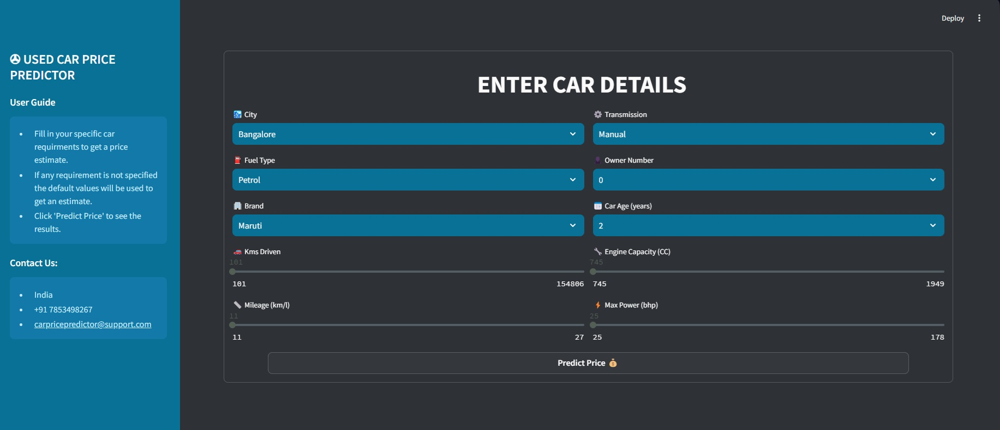
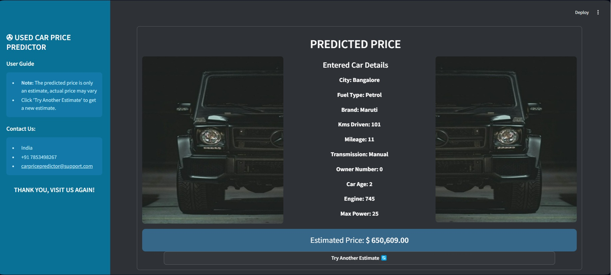

<h1 align="center">CAR DHEKO - USED CAR PRICE PREDICTION</h1>

<h3 align="center">The primary objective of this project is to develop a regression model that can effectively predict the price of used cars </h3>

---
## Objectives:

**Given is the historical data of used car prices of six cities including various features such as make, model, year, fuel type, transmission type, and other relevant attributes from Car Dheko. Your task is to:** 

- Import the unstructured datasets, convert them into a structured format & concatenate all datasets into a single dataset. 
- Preprocess the structured data (Handle missing values, Standardize data formats, Remove outliers & Encode categorical variables).
- Do Exploratory Data Analysis (EDA) on the data (Provide descriptive statistics, data visualization & indentify important features)
- Develop a machine learning model that can accurately predict the prices of used cars based on these features.
- Evaluate model performance using MSE, MAE & R-squared metrics & compare models.
- Optimize the model using feature engineering or regularization to improve model performance.
- Choose the best model & integrate it into a Streamlit-based web application to allow users to input car details and receive an estimated price instantly.

---
## Domain:
- **Automotive Industry**
- **Machine Learning**
- **Data Science**

---
## Skill Take Aways from this Project:
- Data Cleaning and Preprocessing
- Exploratory Data Analysis
- Machine Learning Model Development
- Price Prediction Techniques
- Model Evaluation and Optimization
- Model Deployment
- Streamlit Application Development
- Documentation and Reporting

---
## Unstructured Datasets:

- **Unclean datasets:**
  * https://drive.google.com/drive/folders/16U7OH7URsCW0rf91cwyDqEgd9UoeZAJh
- **Feature Description Link:** 
  * https://docs.google.com/document/d/1hxW7IvCX5806H0IsG2Zg9WnVIpr2ZPueB4AElMTokGs/edit?usp=sharing

---
## Cleaned Dataset Overview

<h3 align="left">The top 5 rows of All_Cities_Cleaned</h3>

|     | City      | Fuel Type | Kms Driven | Transmission | Owner Number | Brand   | Price  | Seats | Mileage | Engine | Max Power | Torque | Car Age |
| --- | --------- | --------- | ---------- | ------------ | ------------ | ------- | ------ | ----- | ------- | ------ | --------- | ------ | ------- |
| 0   | Bangalore | Petrol    | 120000     | Manual       | 3            | Maruti  | 400000 | 5     | 23      | 998    | 67        | 90     | 10      |
| 1   | Bangalore | Petrol    | 32706      | Manual       | 2            | Ford    | 811000 | 5     | 17      | 1497   | 121       | 150    | 7       |
| 2   | Bangalore | Petrol    | 11949      | Manual       | 1            | Tata    | 585000 | 5     | 23      | 1199   | 84        | 114    | 7       |
| 3   | Bangalore | Petrol    | 17794      | Manual       | 1            | Hyundai | 462000 | 5     | 19      | 1197   | 81        | 113    | 11      |
| 4   | Bangalore | Diesel    | 60000      | Manual       | 1            | Maruti  | 790000 | 5     | 23      | 1248   | 88        | 200    | 10      |
|     |

<h3 align="left">Feature Description of All_Cities_Cleaned</h3>

- **City:** Name of the city where the car is being sold
- **Fuel Type:** Fuel type of the car
- **Kms Driven:** No. of kilometers driven by the car
- **Transmission:** Gear transmission of the car
- **Owner Number:** No. of people who owned the car previously
- **Brand:** Brand name of the car
- **Price:** Price at which the car was sold (also, the TARGET variable of the dataset)
- **Seats:** No. of seats in the car
- **Mileage:** kmpl that the car can travel
- **Engine:** CC of the car's engine
- **Max Power:** Maximum power that the car's engine can produce
- **Torque:** Traction that the car's engine can produce
- **Car Age:** Age of the car
  
---
## Models Used

- **Linear Regression** is a supervised machine learning algorithm that is used to predict a continuous dependent variable (i.e. a real value) based on one or more independent variables. It assumes a linear relationship between the independent variables and the dependent variable, and uses this relationship to fit a line through the data points. 
  * **Model Evaluation**
    - Training R² = 0.856  → 85.6% of variance in training data.
    - Testing R² = 0.860 → Slightly better fit on test data.
    - Issue → High MSE & MAE, indicates that the model doesn’t capture nonlinear relationships effectively.
    - ***Inference* → Linear Regression assumes a straight-line relationship between features & target. Since the dataset is non-linear, this model struggles to capture the full complexity.**

- **Decision Tree Regressor** is a type of supervised machine learning algorithm that is used for regression tasks. It is a decision tree algorithm where each internal node represents a feature and each leaf node represents a predicted value. The tree is constructed by recursively splitting the feature space into smaller regions, with each split chosen to minimize a certain impurity criterion such as mean squared error. 
  * **Model Evaluation**
    - Training R² = 0.999 → Almost perfectly fits training data.
    - Testing R² = 0.895 → Huge drop, showing overfitting.
    - Issue → Overfitting Model memorized training data but fails to generalize.
    - ***Inference* → Extreme overfitting on train data & poor generalization to unseen data**

- **Random Forest Regressor** is an ensemble machine learning algorithm that is used for regression tasks. It is based on the decision tree algorithm, but instead of building a single decision tree, it builds multiple decision trees and combines their predictions to produce a final result.
  * **Model Evaluation**
    - Training R² = 0.991 → High but less overfit than Decision Tree
    - Testing R² = 0.943 → Good but shows gap, fails to generalize
    - Issue: Overfitting but much better than Decision Tree.
    - ***Inference* → The testing MSE & MAE are lower than Decision Tree, meaning it makes better predictions.**
  
- **Gradient Boosting Regressor** is a ensemble learning machine learning algorithmthat is used for classification & regression tasks. It is a boosting algorithm which combine multiple weak learner to create a strong predictive model. It works by sequentially training models where each new model tries to correct the errors made by its predecessor.
  * **Model Evaluation**
    - Training R² = 0.941  → Lower than Random Forest (suggests less overfitting).
    - Testing R² = 0.933 → Good generalization, slightly lower than Random Forest.
    - Issue → High Train & Test MAE than RF indicating large error range but performance is stable.
    - ***Inference* → MSE & MAE are slightly worse than Random Forest, but still better than Decision Tree & Linear Regression.**
---
## Optimizing Models:

- ***Optimized both Random Forest & Gradient Boosting models using the same feature engineering techniques & hyper parameter tuned to get better results***
  
<h3 align="left"> Building Models</h3>

- **Models 0 (Random Forest & Gradient Boosting)**
  * Uses the OG dataset 
  * Trained on default parameters
- **Models 1 (Random Forest(Base) & Gradient Boosting(Base))**
  * Used the Feature Engineered dataset 
  * Trained on default parameters
- **Models 2 (HP Tuned Random Forest & HP Tuned Gradient Boosting)**
  * Used the Feature Engineered dataset 
  * Hyper parameter tuned using RandomSearchCV 
- **Models 3 (HP Tuned Random Forest 2 & HP Tuned Gradient Boosting 2)**
  * Futher Feature Elimination based on feature_importances_ of HP Tuned Random Forest & HP Tuned Gradient Boosting respectively
  * Hyper parameter tuned using RandomSearchCV 
  
---
## Evaluation of Optimized Models:

<h3 align="left">Model-Specific Analysis of Random Forest Models</h3>

| Model | Model name           | Training R² | Testing R² |
| ----- | -------------------- | ----------- | ---------- |
| 0     | Random Forest        | 0.991674    | 0.943553   |
| 1     | Random Forest (Base) | 0.991485    | 0.939585   |
| 2     | HP Tuned RF          | 0.991562    | 0.941124   |
| 3     | HP Tuned RF 2        | 0.951445    | 0.927455   |

## ***HP Tuned RF 2 sacrifices a bit of training performance but significantly reduces overfitting & Feature reduction helped balance the importance scores, leading to better generalization, making it the best model.***
## ***Though the HP Tuned RF 2 is the best model it's test MAE is higher than the basic Gradient Boosting model. So, let's see the results of optimized Gradient Boosting models & see which model is performing better***

<h3 align="left">Model-Specific Analysis of Gradient Boosting Models</h3>
  
| Model | Model name               | Training R² | Testing R² |
| ----- | ------------------------ | ----------- | ---------- |
| 0     | Gradient Boosting        | 0.941162    | 0.933065   |
| 1     | Gradient Boosting (Base) | 0.939063    | 0.931166   |
| 2     | HP Tuned GB              | 0.9904      | 0.953564   |
| 3     | HP Tuned GB2             | 0.968806    | 0.938032   |

#### ***HP Tuned Gradient Boosting is the best tradeoff between Accuracy & Generalization, though slightly Overfit.***
---

## Streamlit Application
- The Streamlit application provides an interactive interface where users can input car specifications and obtain a predicted price. 
- The app is designed to be intuitive, and comes with an user guide making it easy to use & is accessible for both customers and sales representatives.
  
**HOME PAGE**

**PREDICTION PAGE**

**RESULT PAGE**

